# ДЗ2. BitTorrent

> retrieve the most popular download from top 10 BitTorrent trackers. Make stats on download speed, user population, clients used.

Запускали плюсовый скрипт скачивания на VM в Yandex Cloud на минуту. Собирали статистики предоставляемые библиотекой:
- download_rate
- upload_rate
- num_peers
- num_seeds

Дополнительно считали клиенты пиров.

Популярные трекеры мы искали в статьях (например https://torrentfreak.com/top-torrent-sites/). Мы рассматривали только трекеры с UI, в котором можно было найти самый популярные раздачи.

Мы взяли следующий набор трекеров и файлов на них.

| Tracker | File name |
|---|---|
| 1337x | A.Knight.of.the.Seven.Kingdoms.S01E05.1080p.x265-ELiTE |
| nyaa | [Erai-raws] Sousou no Frieren 2nd Season - 07 [1080p CR WEB-DL AVC AAC][MultiSub][F0741162].mkv |
| piratebay | Rhinoceros v6.13.19058.00371 (x64) + Crack {B4tman} |
| limetorrents | Cold Storage (2026) [1080p] [WEBRip] [5.1] [YTS.BZ] |
| eztv | The.Pitt.S02E09.1080p.WEB.h264-ETHEL[EZTVx.to].mkv |
| yts | Doctor Strange In The Multiverse Of Madness (2022) [720p] [BluRay] [YTS.MX] |
| rutor | Young.Sherlock.S01.2160p.HDR |
| ext torrents | Good.Luck.Have.Fun.Dont.Die.2026.1080p.WEBRip.10Bit.DDP.5.1.x265-NeoNoir.mkv |
| sk torrent | Weapons (2025) [1080p] [WEBRip] [5.1] [YTS.MX] |
| rargb | The.Substance.2024.1080p.WEBRip.1600MB.DD5.1.x264-GalaxyRG[TGx] |

### Популярность

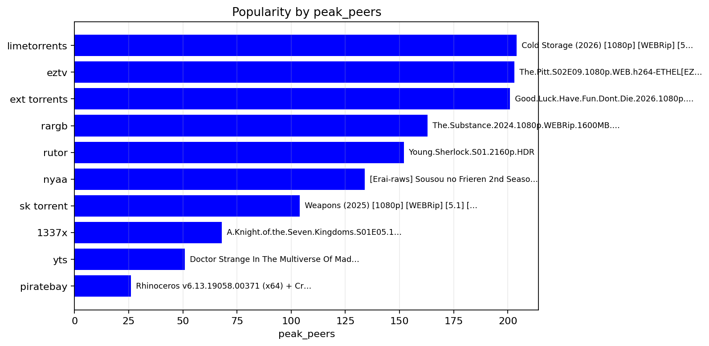
График трекеров по количеству пиров

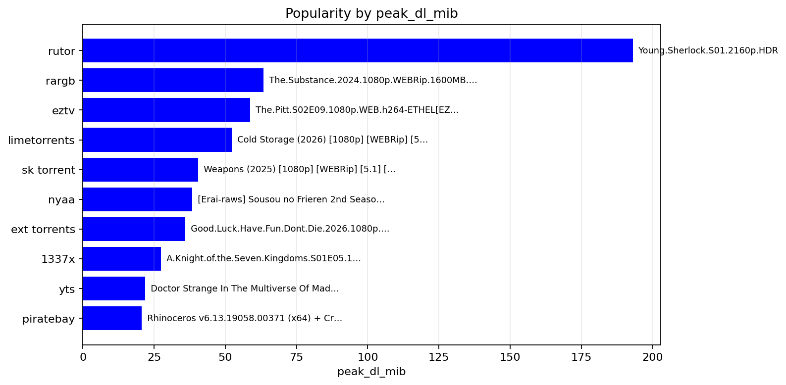
График трекеров по скорости установки

### Скорость

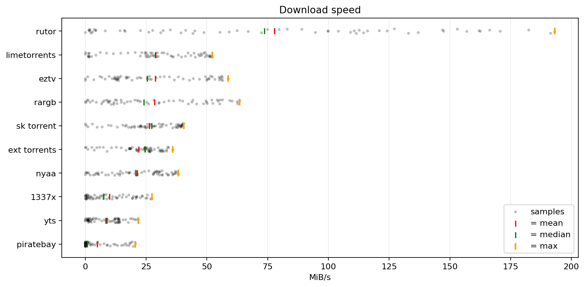
График скорости загрузки

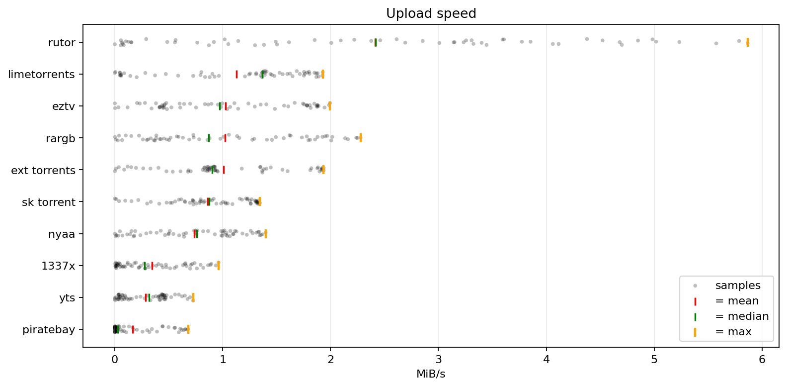
График скорости отдачи

### Количество seed'ов vs количество leecher'ов

Логика этого графика показать, насколько раздача (рой) жива.

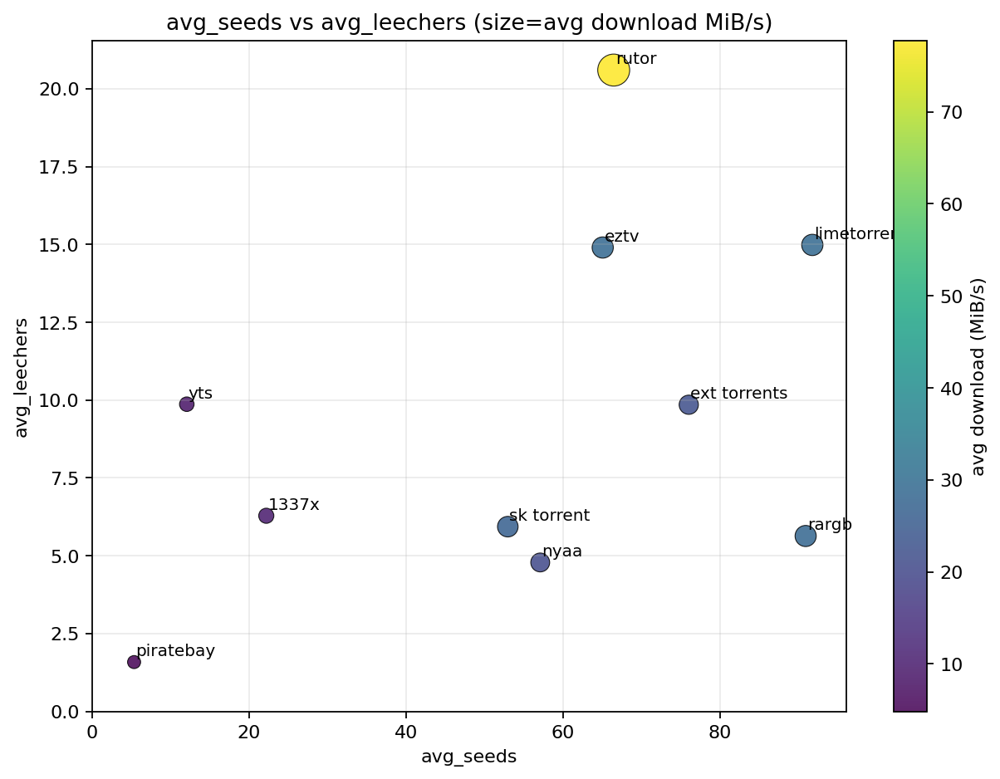

### Используемые клиенты

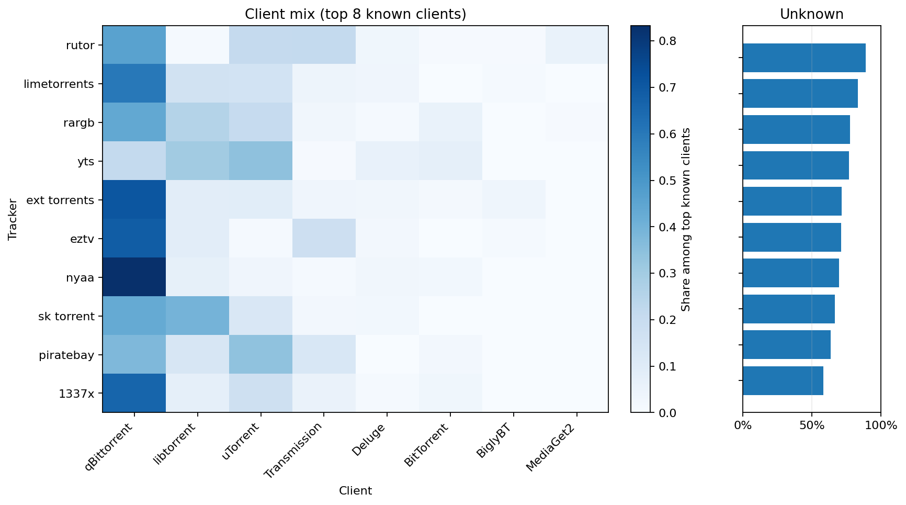

### Подробная статистика

#### nyaa
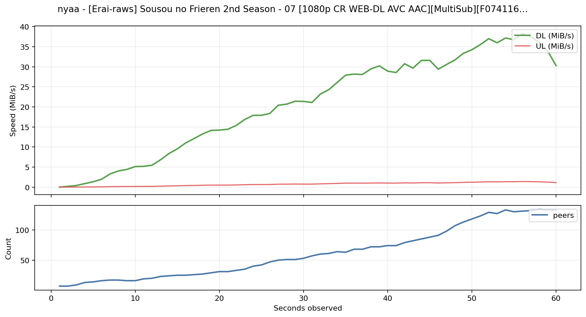

#### limetorrents
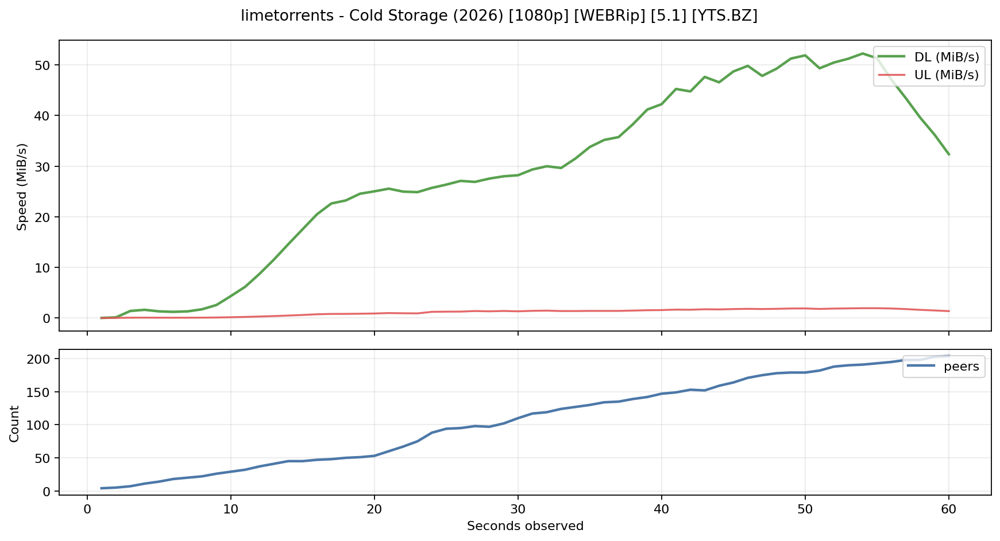

#### eztv
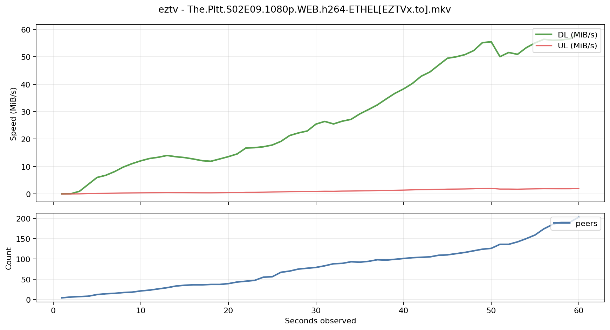

#### 1337x
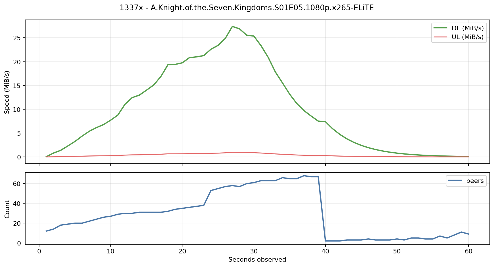

#### piratebay
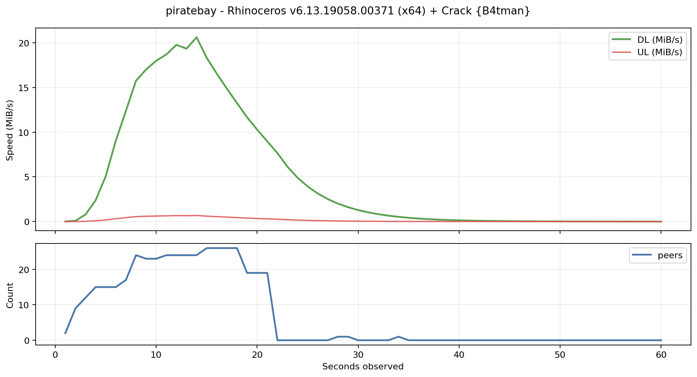

#### yts
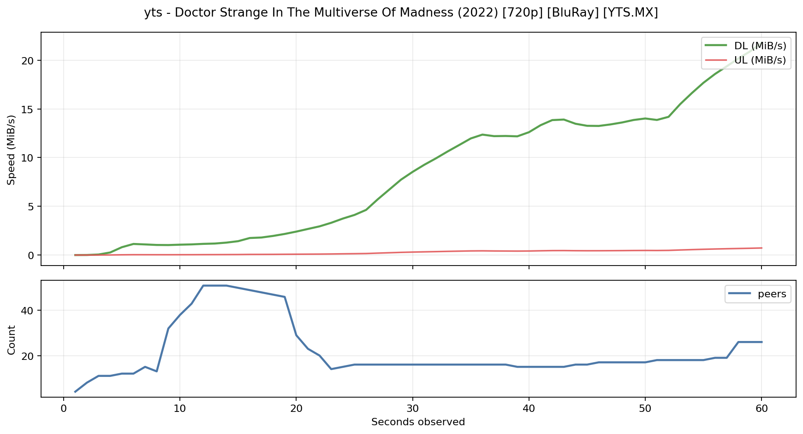

#### rutor
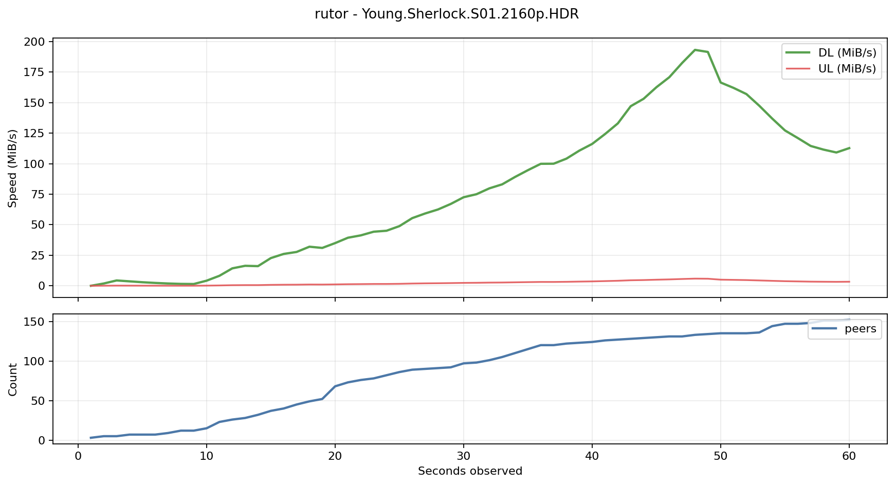

#### ext torrents
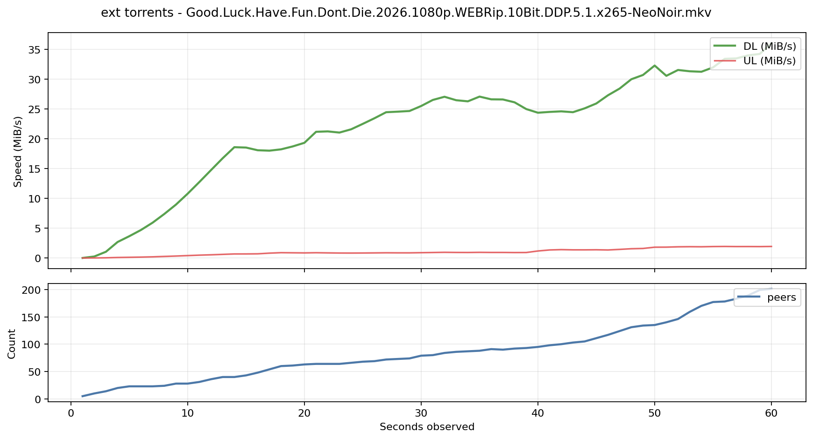

#### rargb
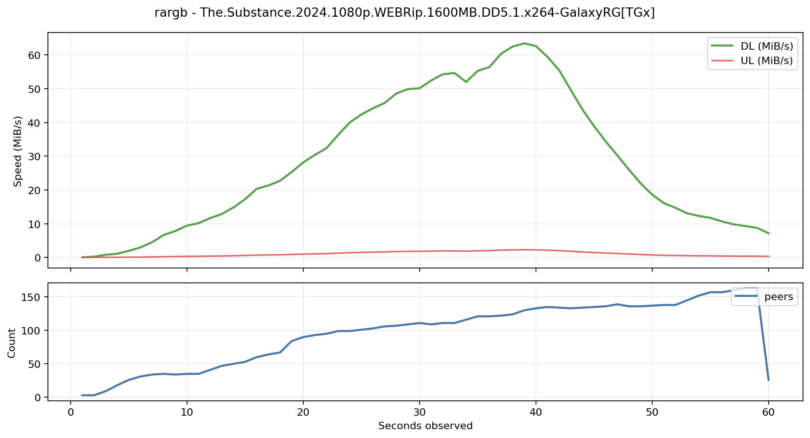

#### sk torrent
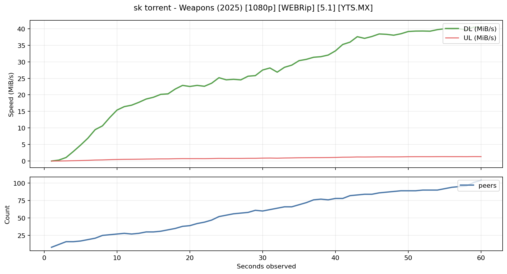
