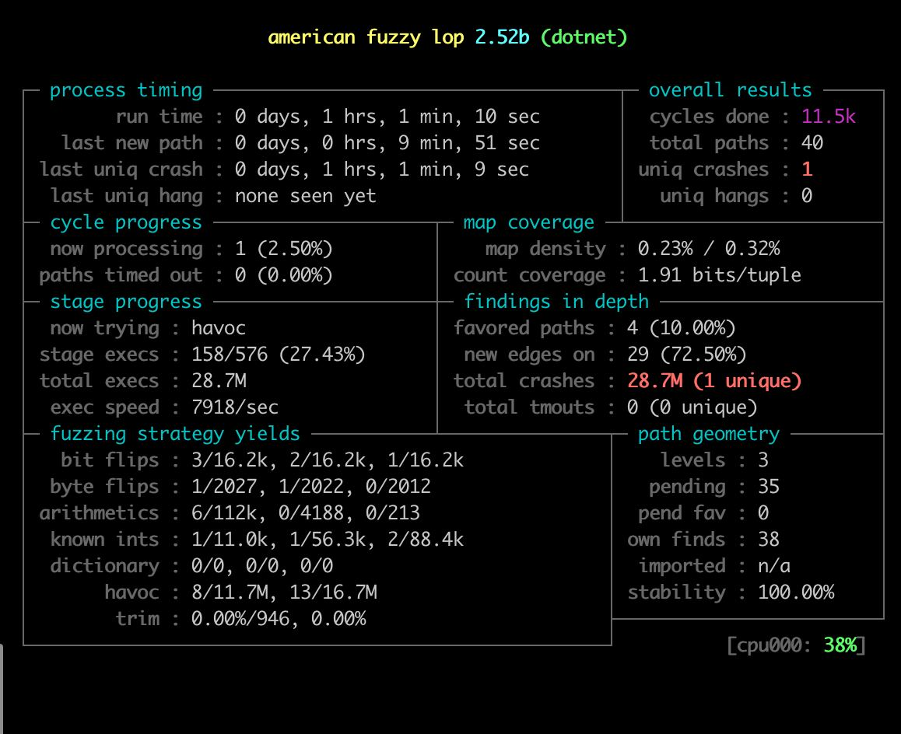

## Обнаруженные и исправленные баги:
1) проверка наличия полной информации о студенте (всех полей структуры Student)
2) проверка на правильную последовательность полей в структуре 
3) проверка, что за практики выставлена оценка 0 или 1
4) проверка (с помощью regex pattern) валидности строковых полей
5) вывод сообщения о некорретных входных данных "Malformed input"
6) проверки на оценку за проект и итоговую оценку
7) проверка на то, что итоговая оценка (float) в случае нуля представляется валидно

## Важные замечания

1. **Так как мы не представляем float числа точно, то, возможно, будет нарушена round-trip guarantee, если начинать с файла с расширением .bin.** 

Дело в том, что при переводе из бинарного формата в формат KV мы обрезаем float до 6 знаков после запятой. 
При преобразовании в KV формат итоговая оценка студента (имеет тип float) может чуть-чуть измениться за счет этого. Естественно, в таком случае будет различие в бинарных файлах: исходном и полученном.

Считаем эту ситуацию естественной и не нарушающей round-trip guarantee.

2. **Добавлены дополнительные проверки валидности входных данных. Примеры валидных входных данных можно взять в 09-fuzz/fuzz-kopylov/Fuzz/validFilesExamples**

3. **Поправленный код находится в файлах**

    I) _09-fuzz/fuzz-kopylov/ParseLibrary/MainParser.cs_ 

    и 

    II) _09-fuzz/kv-triapitsyn-kopylov.cs_ 

    **Содержимое файлов одинаковое, можно проверять любой.**
    В директории fuzz-kopylov находится всё про фаззинг.


## Как проверял

Фаззил по 60 минут в каждую сторону (преобразования начинаются с .kv; преобразования начинаются с .bin) на своей ВМ. Процесс фаззинга описан в следующих разделах.


На фото ниже единственный найденный unique crash соответствует входным данным, на которых выдается "Malformed input" – это нормально и не является багом в решении.




## Как запускать фаззинг

### Предварительно нужно:

1) В директорию 09-fuzz/fuzz-kopylov/Fuzz/Testcases нужно положить валидный файл test.kv или test.bin. Примеры валидных файлов можно взять из директории  09-fuzz/fuzz-kopylov/Fuzz/validFilesExamples

2) В 09-fuzz/fuzz-kopylov/Fuzz/Fuzz.csproj нужно поменять/добавить

```    
    <ItemGroup>
        <Content Include="Testcases\test.kv" CopyToOutputDirectory="Always" CopyToPublishDirectory="Always" />
    </ItemGroup>
```

или

```    
    <ItemGroup>
        <Content Include="Testcases\test.bin" CopyToOutputDirectory="Always" CopyToPublishDirectory="Always" />
    </ItemGroup>
```


3) В файле 09-fuzz/fuzz-kopylov/Fuzz/Program.cs нужно найти переменную **fuzz_bin**. Если мы указали в Testcases (см. пункт 1) файл с расширением  .bin, то нужно выставить эту fuzz_bin = true. Если мы указали в Testcases (см. пункт 1) файл с расширением  .kv, то нужно выставить эту fuzz_bin = false.

### Что происходит во время фаззинга
Рассмотрим на примере, где в Testcases файл test.bin. Для случая, когда файл с расширением .kv, всё аналогично, только расширения файлов в обосновании ниже противоположные (.bin вместо .kv, .kv вместо .bin).

1) Из входных данных читается информация о студенте или студентах. 
2) Записываем эту информацию о студентах в файл test_initial.bin. 
3) Файл test_initial.bin преобразуется в test_input.kv
4) Файл test_input.kv преобразуется в test_input.bin
5) Побитно сравниваются файлы test_initial.bin (исходный файл) и test_input.bin (файл, полученный в результате двух последовательных преобразований)

Таким образом, фаззинг проверяет в том числе round-trip guarantee.

### Финальная команда для запуска и как использовать её результат
```
olegkopylov@decentralized:~/practice/09-fuzz/fuzz-kopylov/Fuzz$ pwsh fuzzScript/fuzz.ps1 Fuzz.csproj -i Testcases
```

В результате в директории 09-fuzz/fuzz-kopylov/Fuzz/findings/crashes будут примеры таких входных данных, на которых решение либо выводит сообщение "Malformed input", либо падает. 

Ожидаемым является вариант, когда в этой директории на всех файлах (кроме, разумеется, файла README.md), "Malformed input". Также ожидаемо то, что описано выше в разделе _Важные замечания_ насчет неточности для float.

Чтобы проверить, что выводится "Malformed input", можно, находясь в директории olegkopylov@decentralized:~/practice/09-fuzz/fuzz-kopylov/Fuzz, выполнить команды:
1) ```mkdir new2```
2) ```mv findings/crashes/id:000000,sig:02,src:000001,op:flip1,pos:0 new2/test.bin  (обязательно нужно поставить расширение .bin или .kv)```
2) ```bin/Fuzz < new2/test.bin```

или же проверить руками, запустив с помощью приложения:

1) ```olegkopylov@decentralized:~/practice/09-fuzz/fuzz-kopylov/ParseLibrary$ mcs MainParser.cs```
2) ```olegkopylov@decentralized:~/practice/09-fuzz/fuzz-kopylov/ParseLibrary$ ./MainParser.exe ../Fuzz/new2/Testcases/test.kv```

## Как запускать преобразование
Файлы
1) _09-fuzz/fuzz-kopylov/ParseLibrary/MainParser.cs_ 
и 
2) _09-fuzz/kv-triapitsyn-kopylov.cs_ 

совпадают.
Можно запускать любой из них.
Например,

```
olegkopylov@decentralized:~/practice/09-fuzz/fuzz-kopylov/ParseLibrary$ msc MainParser.cs
```

```
olegkopylov@decentralized:~/practice/09-fuzz/fuzz-kopylov/ParseLibrary$ ./MainParser.exe ../Fuzz/tmp/findings/crashes/2.kv
```

## Использованные инструменты для фаззинга

Использовался sharfuzz: https://github.com/Metalnem/sharpfuzz, требуется его предварительная установка

