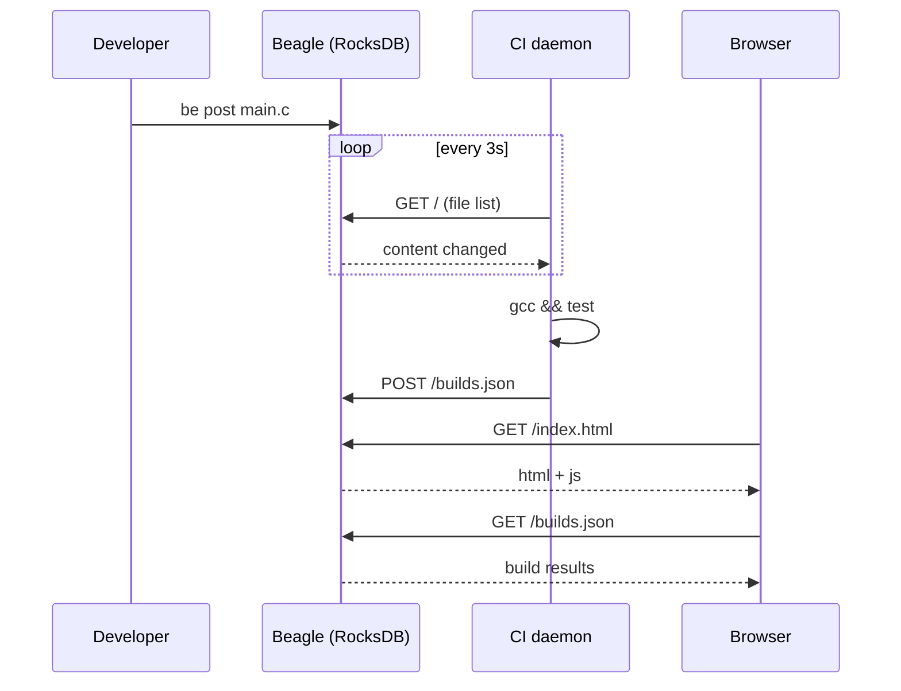

# Beagle CI

Realtime build/CI daemon for [Beagle](https://github.com/gritzko/librdx) — a decentralized source code management system.

## What it does

Beagle CI watches a Beagle project for code changes and automatically runs build and test commands. Results are displayed in a web dashboard.

### How it works

Two processes run inside a Docker container:

- **be-srv** (port 8800) — Beagle's HTTP server. Reads files from RocksDB and serves them over HTTP. Also accepts POST requests to write data back. The dashboard (`index.html`) and build results (`builds.json`) are stored here.

- **daemon.js** — the CI daemon. Every 3 seconds it:
  1. Fetches the file listing from be-srv
  2. Downloads each file and computes a content hash
  3. Compares hashes with the previous poll
  4. If anything changed — runs the build and test commands from `ci.json`
  5. POSTs build results back to be-srv (stored in Beagle)
  6. Also keeps a local fallback on port 8801

The dashboard and all data live inside Beagle and are served by be-srv.

### Developer workflow



## Setup

### Build and run

```bash
docker build -t beagle .
docker run -p 8800:8800 -p 8801:8801 beagle
```

This will:
1. Build librdx (be-srv, be-cli) from source
2. Create a demo C project with `ci.json`
3. Import it into Beagle (including `index.html`)
4. Start be-srv on port 8800
5. Start the CI daemon

Open **http://localhost:8800/index.html** in a browser — the dashboard is served directly from Beagle.

For manual setup inside the container (`docker run -it ... beagle bash`):

```bash
/src/start.sh
```

## Configuration

Place a `ci.json` in the project root:

```json
{
    "name": "myproject",
    "build": "gcc-14 -o main main.c",
    "test": "./main && echo ok"
}
```

| Field   | Description                        |
|---------|------------------------------------|
| `name`  | Project name shown in the dashboard |
| `build` | Shell command to build the project  |
| `test`  | Shell command to run tests (runs only if build passes) |

### Environment variables

| Variable     | Default | Description              |
|-------------|---------|--------------------------|
| `CI_POLL_MS` | 3000    | Poll interval in ms      |
| `CI_PORT`    | 8801    | Dashboard HTTP port      |
| `BE_BIN`     | /src/build/be/be | Path to `be` binary |

### CLI arguments

```
node daemon.js [be-srv-url] [project-dir]
```

- `be-srv-url` — default `http://127.0.0.1:8800`
- `project-dir` — worktree with `.be` file, default `/tmp/testproject`

## Making changes

To push code changes into Beagle, stop be-srv first (RocksDB allows only one writer at file-system level):

```bash
pkill be-srv
echo 'int main() { return 1; }' > main.c
/src/build/be/be post main.c
/src/build/be/be-srv 8800 &
```

The CI daemon will detect the changed content on its next poll and trigger a new build. Results are automatically POSTed back to be-srv.

## Known limitations

- **RocksDB single-writer lock**: `be post` CLI and `be-srv` cannot run simultaneously. Stop the server before using `be post`.
- **Polling-based**: changes are detected by content hashing every 3 seconds, not by push notifications.
- **MIME types**: be-srv may serve HTML as `text/plain` — if the browser shows raw HTML, use the fallback dashboard on port 8801.

## Project structure

```
beagle/
├── Dockerfile          # Ubuntu 24.04 + gcc-14 + deps
├── README.md
├── start.sh            # Entrypoint: init + be-srv + daemon
└── ci-app/
    ├── daemon.js       # CI daemon (Node.js)
    └── index.html      # Web dashboard (stored in Beagle)
```
