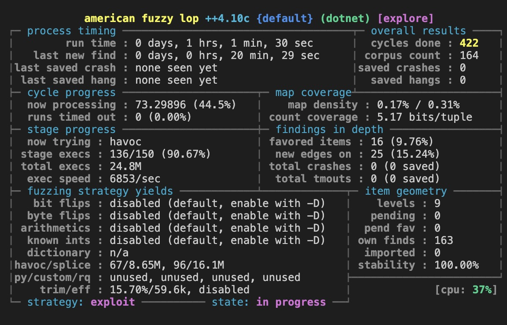
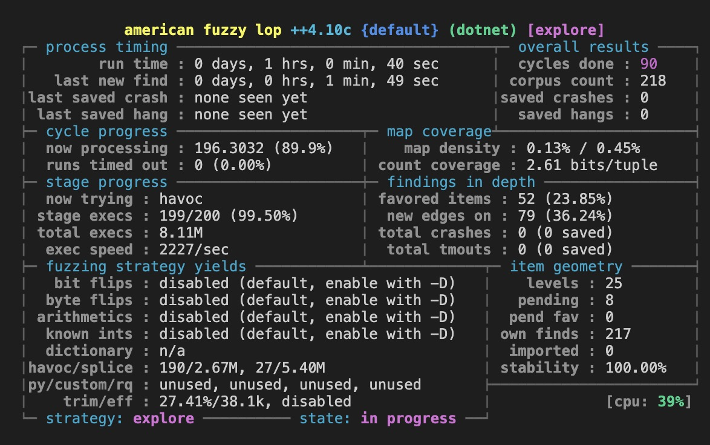

## TLDR Что было сделано?
- Написал компораторы для бинарных и json-файлов
- Написал программы для фаззинг-теста BinToJson и JsonToBin
- Нашел и исправил баги в решении

## Исправленные баги
- Добавлена проверка, что бинарные данные на входе выровнены по 128
- Добавлена проверка, что string содержат человекочитаемые символы
- Добавлена проверка, что оценка за практику только 0 или 1
- Добавлена проверка, что итогая оценка может быть валидно представлена как floating-point тип
- Добавлена проверка, что строковые данные помещаются в соответствующий массив с фиксированным размером
- Добавлена проверка, что входящий json возможно распарсить
- Добавлена проверка, что входящие бинарные данные возможно распарсить
- Добавлена проверка входящих аргументов

В случае битых входных данных теперь выбрасывается исключение с ошибкой `ParseException`.

## Струтура директорий
- `BaseParseLibrary/` - исходное решение, которое тестируем и исправляем
- `FixedParseLibrary/` - исправленное решение
- `FuzzBinToJson/` - фаззинг-тест, проверяющий round-trip guarantee для C-формата (bin->json->bin)
- `FuzzJsonToBin/` - фаззинг-тест, проверяющий round-trip guarantee для json (json->bin->json)
    - содержимое аналогично `FuzzBinToJson/`

## Как фаззил
Для фаззинга используется [sharpfuzz](https://github.com/Metalnem/sharpfuzz). 
- BinToJson фаззим из директории `FuzzBinToJson/` командой:

    ```pwsh script/fuzz.ps1 FuzzBinToJson.csproj -i testcases```
- Для фаззинга JsonToBin пользуемся аналогичной командой из соответствующей директории:

    ```pwsh script/fuzz.ps1 FuzzJsonToBin.csproj -i testcases```

И для `FuzzBinToJson`, и для `FuzzJsonToBin` процессы идентичные.
Будем рассматривать что происходит на примере `FuzzBinToJson`: 
- входные фаззинг-данные записываются в файл `test.bin`, они парсятся в json-формат в файл `test.json` и переводятся обратно в `result.bin`; 
- далее мы проверяем, что содержимое test.bin и result.bin совпадает; 
- если нет, то тест крашится.

Фаззил в обе стороны по часу:

<p align="center">
  
  <br>
  <em>BinToJson</em>
</p>

<p align="center">
  
  <br>
  <em>JsonToBin</em>
</p>

## Про исправленное решение
1. Перевести bin->json или json->bin:

    ```dotnet run test.XXX```

2. Перевести bin->json->bin или json->bin->json и сравнить файлы на round-trip guarantee:

    ```dotnet run test test.XXX```

3. Сравнить файлы на round-trip guarantee:

    ```dotnet run test_1.XXX test_2.XXX```

Где `XXX` = `bin`/`json` (в зависимости от того, что проверяем)