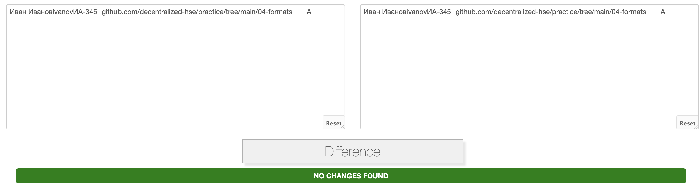

# 09-fuzz
---

Фаззинг произволился над `04-formats/protobuf-rakhmanov`

---

### Установка
> Выполнялась на Mac M1 (Arm64)

```shell
# Установка Java + Maven + Jazzer
brew install java 
brew install maven
wget https://github.com/CodeIntelligenceTesting/jazzer/releases/download/v0.22.1/jazzer-macos.tar.gz
tar zxf jazzer-macos.tar.gz
# Сборка проекта
mvn install:install-file -Dfile=/Users/nickoliger/Desktop/HSE_Courses/hse-decentralized/09-fuzz/protobuf-rakhmanov-oliger/jazzer/jazzer_standalone.jar  -DgroupId=com.code_intelligence -DartifactId=jazzer -Dversion=0.22.1 -Dpackaging=jar
mvn clean install -U
```

---

### Запуск фаззинга

```sh
jazzer/jazzer --cp=target/04-formats-1.0-SNAPSHOT-jar-with-dependencies.jar --target_class=Fuzzer --target_method=fuzzerTestOneInput
```

---

### Баги и замечания

1) Добавил Maven (фреймворк для автоматической сборки проектов на Java), аналогично другим проектам, написанным на Java.

2) Добавлено закрытие файловых дескрипторов (`inChannel.close();`)

3) Добавлен try-catch в Insert блоке

4) Добавлена очистка файлов в случае перезаписи(`os.getChannel().truncate(0);`)

5) Добавлена проверка корректности формата вводимых данных

---

### Пример работы

Корректная работа на корректных данных:



Пример логов работы фаззинга можно посмотреть в файле `output-example.logs`

В случае падения к стэктрейсу будет приложена информация о вводе:

```Java
System.err.printf("\n---GOOD---\n");
System.err.printf(Arrays.toString(bytes));
byte[] array = Files.readAllBytes(Paths.get("input.bin"));
System.err.printf("\n---BAD----\n");
System.err.printf(Arrays.toString(array));
System.err.printf("\n----------\n");
```

---
