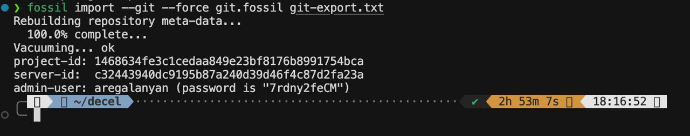

# Сравнение базовых операций Git и Fossil на примере репозитория Git

## Введение

Данный отчёт описывает процесс миграции репозитория Git в Fossil и последующее сравнение выполнения базовых операций между двумя системами контроля версий. В качестве тестового репозитория используется сам репозиторий Git, что позволяет проверить работу систем на реальном крупном проекте.

## Цели исследования

Основная задача исследования — провести сравнительный анализ выполнения базовых операций в Git и Fossil на примере реального крупного репозитория.

1. Выявить различия в поведении команд
2. Оценить производительность операций
3. Проанализировать различия в модели данных и концепциях
4. Документировать особенности работы каждой системы

## Подготовка данных

### Этап 1: Создание bare-репозитория Git

Первым шагом был создан bare-репозиторий Git с помощью команды:

```bash
git clone --mirror ссылка_на_репу_гита
```

**Объяснение параметров:**
- `--mirror`: Создает полную зеркальную копию исходного репозитория, включая все ветки, теги и удаленные ссылки. В отличие от обычного клонирования, создается bare-репозиторий (без рабочей директории), который содержит полную историю и метаданные.

Результат: создан директорий `git-bare.git` с полной структурой Git-репозитория.

### Этап 2: Экспорт истории Git в текстовый формат

Для последующего импорта в Fossil был выполнен экспорт всей истории репозитория:

```bash
git --git-dir=git-bare.git fast-export --all --reencode=yes --signed-tags=strip --tag-of-filtered-object=drop > git-export.txt
```

**Объяснение параметров:**
- `--git-dir=git-bare.git`: Путь к git-репозиторию.
- `fast-export`: Команда git для экспорта истории репозитория в текстовый формат, понятный для импорта в другие системы контроля версий (включая Fossil).
- `--all`: Экспортирует все ветки и теги репозитория.
- `--reencode=yes`: Перекодирует сообщения коммитов и имена файлов в UTF-8.
- `--signed-tags=strip`: Удаляет GPG-подписи из тегов. Fossil не поддерживает GPG-подписи тегов, поэтому они должны быть удалены для успешного импорта.
- `--tag-of-filtered-object=drop`: Удаляет теги, которые ссылаются на объекты, не включенные в экспорт (например, из-за фильтрации). Это предотвращает ошибки при импорте.

Результат: создан файл `git-export.txt` размером **7.5 GB**, содержащий полную историю репозитория в формате fast-export.

### Этап 3: Импорт в Fossil

Импорт экспортированной истории в Fossil был выполнен командой:

```bash
fossil import --git --force git.fossil git-export.txt
```

**Объяснение параметров:**
- `import`: Команда Fossil для импорта истории из других систем контроля версий.
- `--git`: Указывает, что импортируемый файл находится в формате git fast-export.
- `--force`: Принудительно перезаписывает существующий репозиторий, если он уже существует.
- `git.fossil`: Имя создаваемого Fossil-репозитория.
- `git-export.txt`: Путь к файлу экспорта из git.

**Особенности процесса импорта:**
- Импорт занял приблизительно **3 часа** обработки
- Fossil обрабатывал все коммиты последовательно, по датам, начиная с 2006 года
- В результате создан репозиторий `git.fossil` размером **2.0 GB** (сжатие с 7.5 GB до 2.0 GB благодаря внутреннему формату хранения Fossil)



### Этап 4: Открытие рабочей директории Fossil

После успешного импорта была создана рабочая директория:

```bash
mkdir fossil-workspace
cd ./fossil-workspace
fossil open ../git.fossil
```

**Объяснение команд:**
- `mkdir fossil-workspace`: Создает директорию для рабочего дерева Fossil.
- `fossil open ../git.fossil`: Открывает Fossil-репозиторий в текущей директории, создавая рабочее дерево с файлами из последнего коммита (по умолчанию на ветке trunk).

Результат: создана рабочая директория `fossil-workspace` с файлами проекта Git.

## План сравнения

1. Базовая проверка данных
2. Сравнение операций просмотра и навигации
3. Сравнение операций работы с ветками
4. Сравнение операций создания коммитов
5. Сравнение дополнительных операций
6. Анализ производительности

## Отчеты по этапам

Детальные отчеты по каждому этапу сравнения:

- [1. Верификация корректности импорта](1.%20Верификация/ОТЧЕТ.md)
- [2. Результаты сравнения операций просмотра и навигации](2.%20Просмотр%20истории/ОТЧЕТ.md)
- [3. Результаты сравнения операций работы с ветками](3.%20Работа%20с%20ветками/ОТЧЕТ.md)
- [4. Результаты сравнения операций создания коммитов](4.%20Создание%20коммитов/ОТЧЕТ.md)
- [5. Результаты сравнения дополнительных операций](5.%20Дополнительные%20операции/ОТЧЕТ.md)
- [6. Анализ производительности](6.%20Производительность/ОТЧЕТ.md)

## Итоговый отчет

Полный итоговый отчет со всеми выводами, сравнениями и рекомендациями:

- [Итоговый отчет: Сравнение Git и Fossil](ИТОГОВЫЙ_ОТЧЕТ.md)

Результат: проведено сравнение базовых операций Git и Fossil, подробнее описано в соответствующих отчетах.
